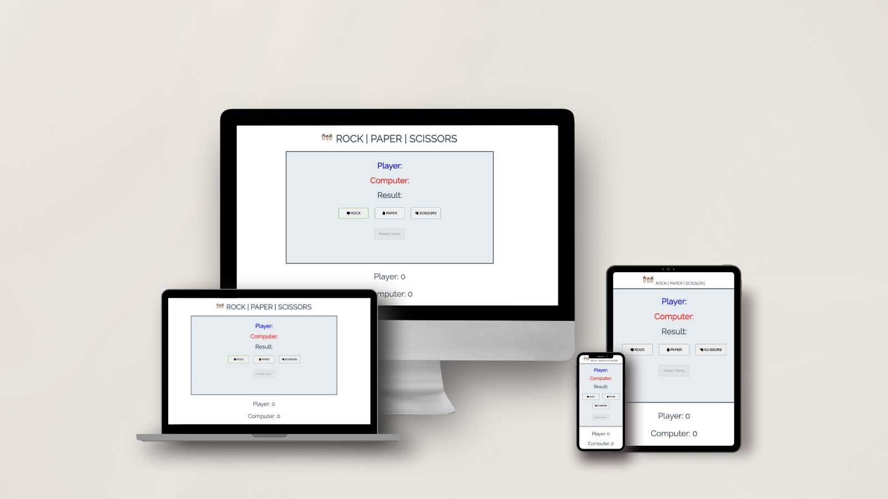
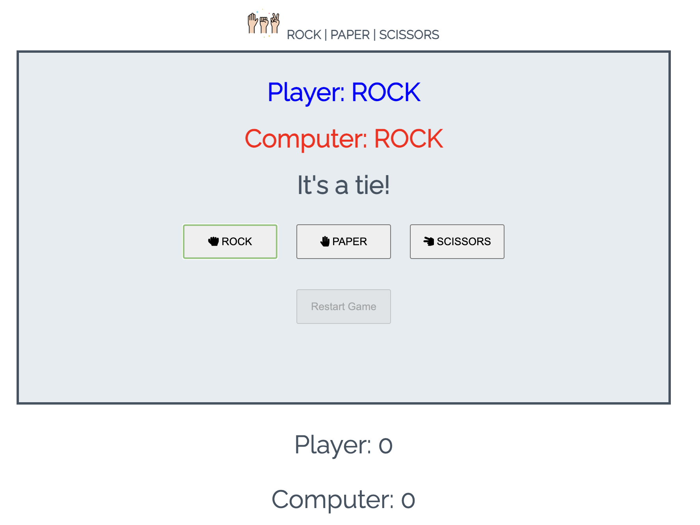
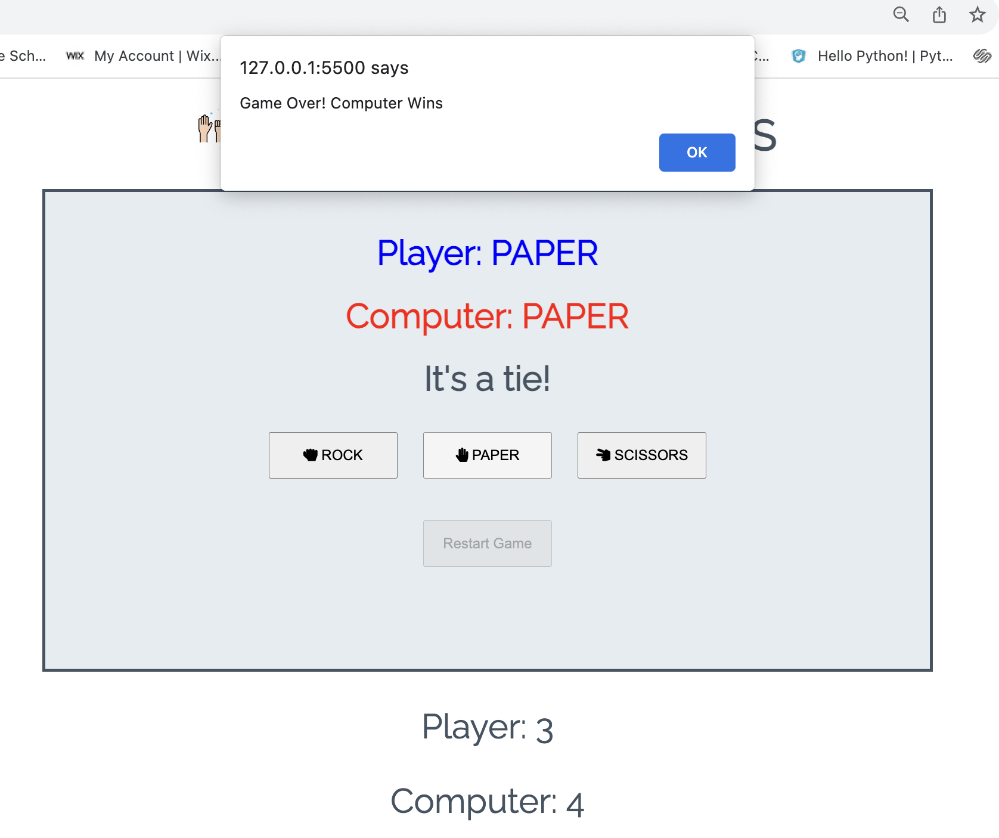
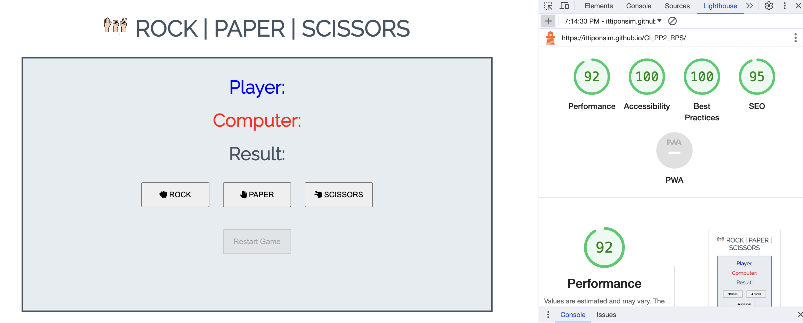
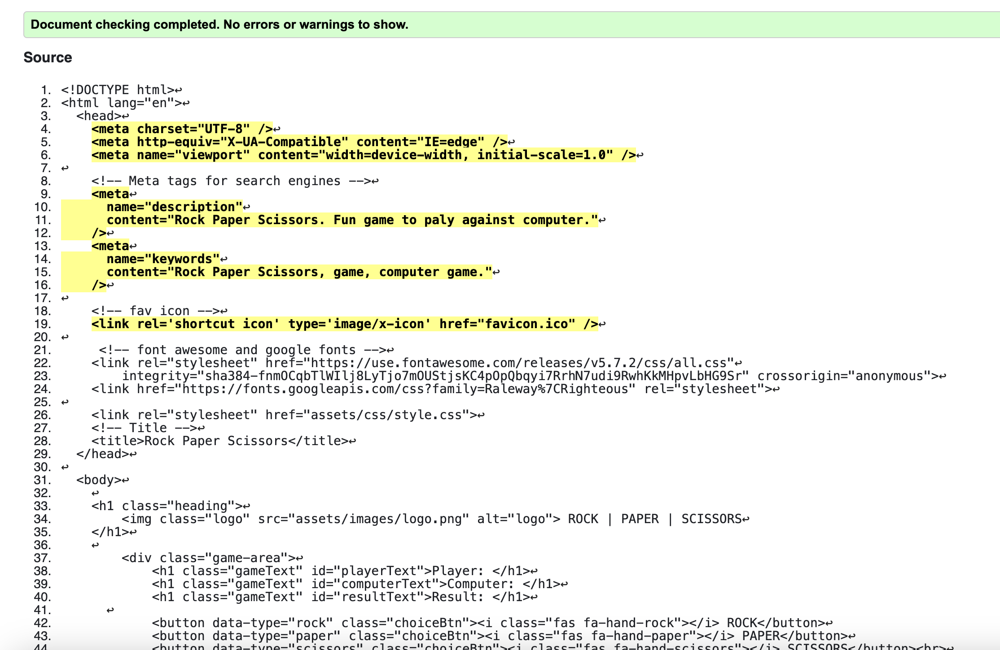
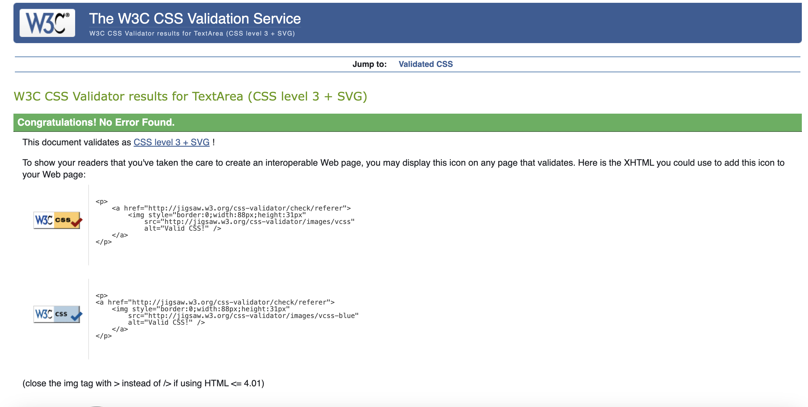
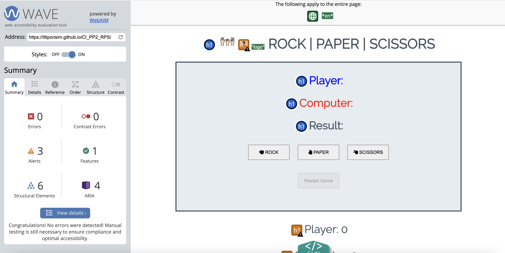

 Game Center : [ Rock Paper Scissors ](https://ittiponsim.github.io/CI_PP2_RPS/)

Welcome to a digital arena where classic meets contemporary—the Rock, Paper, Scissors game like you've never experienced before! Crafted with love using HTML, CSS, and JavaScript, our game brings the timeless charm of this childhood favorite into the digital age.

Purpose:
Whether you're a casual gamer looking for a quick thrill or a strategic mind honing your decision-making skills, our Rock, Paper, Scissors game is designed for pure, unadulterated fun. It's a virtual battleground where luck dances with strategy, and every choice you make determines your fate.

For Whom:
This game is tailored for everyone, from kids rediscovering the joy of playground classics to adults seeking a nostalgic break from the daily grind. Friends looking to settle disputes, colleagues in need of a quick team-building activity, or solo players challenging their own wits—Rock, Paper, Scissors transcends age and brings people together in a lighthearted clash of symbols.

Good For:
Entertainment: Unwind and have a blast as you engage in quick, adrenaline-pumping rounds.
Decision-Making Practice: Sharpen your decision-making skills in a playful setting.
Social Connection: Use it as an icebreaker, a friendly competition, or a digital handshake.
So, are you ready to rock, paper, or scissors your way to victory? Click, choose, and conquer the virtual battlefield!

# Features

## Existing Features

* ### Header
Featured at the top of the page, Rock Paper Scissors shows logo and the game name Rock Paper Scissors in a clean and easy to read style.

* ### The Game Options
There are buttons indicated Rock , Paper and Scissors with icons for a player and choose to play.
* ### The Game Results
When the user clicks an option, the JavaScript code chooses a random option for the computer player, then then shows the result of draw, player wins or Computer wins. Scores will be counted for each side.
After one of the players has reached 5 points, the JavaScript alerts " Game Over! " 
the player can restart the game by pressing the unhidden Restart Game button. 

 # Deployment
The site was deployed to GitHub pages. The steps to deploy are as follows:
1. In the GitHub repository, navigate to the Settings tab
2. From the source section drop-down menu, select the Master Branch
3. Once the master branch has been selected, the page will be automatically refreshed with a detailed ribbon display to indicate the successful deployment.

Live link : (https://ittiponsim.github.io/CI_PP2_RPS/)

* ## Lighthouse Testing
 

* ## Validator Testing
* HTML
  No errors were returned when passing through the officail W3C validator.
  

* CSS
No errors were returned when passing through the officail (Jigsaw) validator.

* JavaScript

# Credits
1. I used the code institute template for my coding and I got a lot of insparation from the "Love Maths" project which made me want to make a similar website but a different theme.

## Content
1. The icons in the footer were taken from Font Awesome website.
2. The images used for the gallery page were taken from a website called pexels.

* ## Bugs
  ### Solved Bugs
 * When I first deployed my project to GitHub Pages, my project did not looad style. the CSS link did not work.
 * I soloved the problem by removing the absolute file path to 

  `<link rel = " stylesheet" href = "assets/css/style.css">`

 * Removing the starting / fixed the problem.

---

Happy coding!
